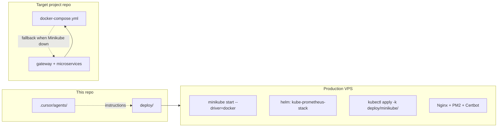

# Deploy Assets Map — Docker, Minikube, Grafana

One-page guide to **where** production infrastructure lives and **what gets created when**.

---

## Three layers (do not confuse them)

| Layer | Location | When it exists |
|-------|----------|----------------|
| **Agents repo (this repo)** | [`deploy/`](deploy/) | Committed — Helm values, Grafana provisioning, Minikube base, scripts |
| **Target app repo** | `docker-compose.yml` at project root | Created by Vikram (JHipster) — **Compose fallback** when Minikube dev cluster is down |
| **VPS at runtime** | Minikube cluster + host Nginx/PM2/PostgreSQL | **One deploy** at #18–#23; redeploy = idempotent `helm`/`kubectl` (same Sunny playbook) |



---

## What is on disk in `deploy/` today

| File / folder | Role |
|---------------|------|
| [`deploy/README.md`](deploy/README.md) | Operator runbook |
| [`deploy/minikube/namespace.yaml`](deploy/minikube/namespace.yaml) | `sunny-prod` namespace |
| [`deploy/minikube/resource-quota.yaml`](deploy/minikube/resource-quota.yaml) | CPU/memory quotas |
| [`deploy/minikube/kustomization.yaml`](deploy/minikube/kustomization.yaml) | Kustomize base |
| [`deploy/minikube/service-template.yaml`](deploy/minikube/service-template.yaml) | Template for Manoj |
| [`deploy/helm/kube-prometheus-stack-values.yaml`](deploy/helm/kube-prometheus-stack-values.yaml) | Grafana NodePort **30300**, Prometheus, Infinity plugin |
| [`deploy/grafana/provisioning/`](deploy/grafana/provisioning/) | Datasources + Sunny dashboard JSON |
| [`deploy/scripts/provision.sh`](deploy/scripts/provision.sh) | Suresh — host toolchain installer |
| [`deploy/scripts/sync-secrets.sh`](deploy/scripts/sync-secrets.sh) | Grafana admin + Postgres K8s secrets from `.env` |
| [`deploy/scripts/health-check.sh`](deploy/scripts/health-check.sh) | Om — end-to-end verification |
| [`deploy/port-map.md`](deploy/port-map.md) | Service → port → NodePort matrix |

**Not generic Sunny** (project extras): `jarvis-voice.service`, `hermes-gateway.service`, `nginx-jarvis-hud.conf`, `hermes.env.example`.

---

## What agents create when

| Artifact | Created / updated by | Dashboard # |
|----------|----------------------|-------------|
| Draft `deploy/port-map.md` rows | Arjun (architecture) | #3 |
| `deploy/minikube/deployment-*.yaml`, `service-*.yaml`, `servicemonitor-*.yaml` | **Vikram** (scaffold); **Manoj** (apply/update on VPS) | #5–#6, #21 |
| `deploy/minikube/namespace.yaml`, Helm values, Grafana provisioning | Rajesh (reconcile repo `deploy/`) | #18 |
| `deploy/nginx/`, `deploy/pm2/` | Asha | #22 |
| Running Minikube cluster, Helm release, live pods | Rajesh + Manoj | #18, #21 |
| Host PostgreSQL databases + roles | Lakshmi | #20 |

**Redeploy:** same agents + `helm upgrade --install` + `kubectl apply -k` — not a second pipeline. Invoke **`@bunny`** / **`Sunny deploy`** (Sunny deploy-only mode).

---

## Docker vs Minikube vs Grafana (plain language)

| Technology | Role in Sunny production |
|------------|-------------------------|
| **Docker** | Installed on VPS; used as **Minikube's container driver** (`minikube start --driver=docker`). Manoj runs `eval $(minikube docker-env)` to build images into Minikube's Docker daemon. |
| **Docker Compose** | **Fallback** when Minikube dev cluster is unavailable. JHipster still generates `docker-compose.yml` in the **app repo**; Sunny agents prefer Minikube + `kubectl` for build/test when the cluster is up. |
| **Minikube** | Runs gateway + microservices + registry as Kubernetes pods in namespace `sunny-prod`. |
| **Helm (`kube-prometheus-stack`)** | Installs **Prometheus + Grafana** in namespace `observability`. Values: [`deploy/helm/kube-prometheus-stack-values.yaml`](deploy/helm/kube-prometheus-stack-values.yaml). |
| **Grafana** | Provisioned from [`deploy/grafana/provisioning/`](deploy/grafana/provisioning/); Sunny progress panel reads `https://<domain>/progress.json` via Infinity datasource. |

---

## Sunny stage → command cheat sheet

| # | Codename | Key commands / files |
|---|----------|----------------------|
| 18 | Rajesh | `minikube start`, `helm upgrade --install kube-prometheus-stack … -f deploy/helm/kube-prometheus-stack-values.yaml` |
| 19 | Suresh | `./deploy/scripts/provision.sh` |
| 20 | Lakshmi | Host PostgreSQL + `.env` credentials |
| 21 | Manoj | `eval $(minikube docker-env)`, `kubectl apply -k deploy/minikube/` |
| 22 | Asha | Host Nginx TLS, PM2, `/api` → gateway NodePort |
| 23 | Om | `./deploy/scripts/health-check.sh` |

Pre-flight: [`bin/smoke-test-deploy.sh`](bin/smoke-test-deploy.sh).

---

## Quick verify (from repo root)

```bash
ls deploy/minikube deploy/helm deploy/grafana/provisioning deploy/scripts
rg "deploy/" .cursor/agents/deployment-platform-agent.md
```

Orchestration docs: [`.cursor/agents/README.md`](.cursor/agents/README.md#production-deployment-assets-deploy) · [`ARCHITECTURE.md`](.cursor/agents/ARCHITECTURE.md) §0.1 · §6.5 · §6.6
