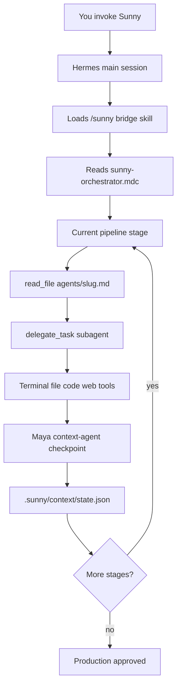

# How Sunny Works on Hermes Agent

A practical guide: what happens when you say **"Sunny, build the backend…"** to Hermes, what the **bridge** does, and what you must install/configure first (LLM API, Docker, domains, etc.).

> **Companion docs:** [HERMES-MAPPING.md](HERMES-MAPPING.md) (technical Cursor→Hermes mapping) · [INSTALL.md](INSTALL.md) (full VPS setup) · [/opt/LAYOUT.md](/opt/LAYOUT.md) (paths on this server)

---

## The three pieces (do not confuse them)

| Piece | What it is | Where it lives |
|-------|------------|----------------|
| **cursor-agents** | Sunny agent **definitions** (62 specialists: Arjun, Vikram, Naveen, …) + orchestration **playbook** | `/opt/cursor-agents/.cursor/` |
| **Hermes Agent** | The **runtime** that actually runs tools (terminal, files, web, delegate sub-tasks) | `/root/.hermes/` |
| **Sunny bridge skill** | Instructions that tell Hermes *"act like Sunny and follow the playbook"* | `/root/.hermes/skills/devops/sunny/SKILL.md` |

**Important:** There are no "Hermes agents" named Arjun or Vikram inside Hermes itself. Those names still live in **cursor-agents**. Hermes **reads** those `.md` files and **delegates** work to sub-sessions that follow them.

**Jarvis** (voice HUD) is separate — optional voice UI on top of Hermes. It does not replace Sunny.

---

## What you type vs what runs

### You say (to Hermes CLI, gateway, Telegram, or Jarvis):

```text
Sunny, build the backend for ./frontend.
Project domain: unitedfinance.qualityoutsidethebox.org
Fleet domain: agentprogress.qualityoutsidethebox.org
```

Or resume after an interrupt:

```text
Sunny, resume
```

Or slash command:

```text
/sunny build backend for ./frontend — domain example.com — fleet global.example.com
```

### Hermes does:



1. Recognizes **Sunny** (skill trigger or natural language).
2. Loads the bridge skill and reads the **playbook**:  
   `/opt/cursor-agents/.cursor/rules/sunny-orchestrator.mdc`
3. Acts as **orchestrator only** — does not write JHipster code itself.
4. For each pipeline stage, loads the specialist persona, e.g.:  
   `/opt/cursor-agents/.cursor/agents/architecture-agent.md`
5. Calls **`delegate_task`** with that persona + stage instructions (Hermes equivalent of Cursor's **Task** tool).
6. Runs **verify → fix** loops until verify agents emit their exact pass phrases.
7. **Maya** (`context-agent`) updates `.sunny/context/state.json` and `progress.json` after each handoff.
8. On interrupt, **`Sunny, resume`** reads `state.json` and continues.

---

## The bridge in one sentence

The **Hermes Sunny bridge** = *"Use Hermes tools to execute the same multi-agent pipeline that Cursor runs, by reading agent files from `/opt/cursor-agents/.cursor/agents/` instead of using Cursor's built-in Task picker."*

| Cursor IDE | Hermes |
|------------|--------|
| Sunny in chat + `sunny-orchestrator.mdc` | Hermes session + `/sunny` skill + same `.mdc` file |
| `Task(subagent_type: "architecture-agent")` | `delegate_task` + content of `architecture-agent.md` |
| `.sunny/context/state.json` | **Same file** on disk in your project |

---

## What you need before calling Sunny

### 1. LLM API (required — Hermes brain)

Hermes itself needs a **language model** to think, plan, and run subagents. Sunny does not provide this — **you configure Hermes**.

**Minimum:** one working provider. Common options:

| Provider | Env var (in `~/.hermes/.env`) | Notes |
|----------|-------------------------------|--------|
| OpenRouter | `OPENROUTER_API_KEY` | Easy multi-model routing |
| Anthropic | `ANTHROPIC_API_KEY` | Claude models |
| Google Gemini | `GEMINI_API_KEY` or `GOOGLE_API_KEY` | Also used by generated app's `aiService` |
| OpenAI | `OPENAI_API_KEY` | GPT models |
| Nous Portal | `hermes setup --portal` | Hosted auth flow |

**Setup commands:**

```bash
source ~/.bashrc   # ensures hermes on PATH
hermes setup       # interactive — pick provider + model
# or
hermes model       # change model later (interactive)
hermes doctor      # must show "API key or custom endpoint configured"
```

**For Sunny pipeline quality:** use a capable model (long context, good at code). The pipeline runs for **hours** and many **delegate_task** rounds — weak or rate-limited keys will stall.

**Separate from Hermes LLM:** the **generated JHipster `aiService`** needs `GEMINI_API_KEY` in the **project** `backend/.env` when you reach that stage. That is app runtime, not Hermes orchestration.

---

### 2. cursor-agents repo (required)

```bash
ls /opt/cursor-agents/.cursor/agents/   # 62 agent .md files
```

Hermes reads agents from here — **not** from inside your app repo unless you symlink.

---

### 3. Project workspace (required)

Example: `/opt/arcadian-wealth`

```bash
# Symlink agent definitions into the project (recommended)
ln -sf /opt/cursor-agents/.cursor /opt/arcadian-wealth/.cursor

# Point Hermes shell cwd at the project
hermes config set terminal.cwd /opt/arcadian-wealth

# Bootstrap codebase graph once
cd /opt/arcadian-wealth && graphify .
```

Sunny writes into the project:

- `backend/` — JHipster microservices  
- `.sunny/` — progress, context, reports  
- `.env` — secrets (Maya generates at intake)

---

### 4. VPS software (required for full pipeline)

| Tool | Purpose |
|------|---------|
| **Docker + Compose** | PostgreSQL, gateway, 8 Java services |
| **Node.js + npm** | Frontend build/tests |
| **Java 17+ / Maven** | Backend builds (or Docker-only builds) |
| **Python 3** | API tests, scripts |
| **Graphify** | `uv tool install graphifyy` — codebase context for agents |
| **nginx + certbot** | HTTPS edge (Naveen stage) |

See [INSTALL.md](INSTALL.md) for install commands.

**Hardware (recommended):** 8+ vCPU, 16 GB RAM, 80 GB disk for full Sunny run with tests.

---

### 5. DNS & network (required before nginx stage)

| Record | Points to |
|--------|-----------|
| Project domain A record | VPS public IP |
| Fleet domain A record (optional) | Central fleet host IP |
| Firewall | 22, 80, 443 open (8787 optional early dashboard) |

---

### 6. Optional but common on this VPS

| Component | Env / path | Purpose |
|-----------|------------|---------|
| **Hermes gateway** | `hermes gateway` / `systemctl start hermes-gateway` | Always-on API, bots, Jarvis |
| **API server** | `API_SERVER_ENABLED=true`, `API_SERVER_KEY` in `~/.hermes/.env` | Jarvis + external clients talk to Hermes |
| **Jarvis HUD** | `/opt/jarvis/`, `JARVIS_HUD_TOKEN` | Voice + browser HUD |
| **ElevenLabs** | `ELEVENLABS_API_KEY` in `~/.hermes/.env` | Jarvis / Hermes TTS voice (not Sunny orchestration) |
| **Fleet dashboard** | Hari agent deploys `/opt/cursor-agents/.cursor/central/` | Multi-VPS progress board |

---

## Environment files (two different `.env` files)

| File | Who uses it |
|------|-------------|
| `~/.hermes/.env` | **Hermes** — LLM keys, ElevenLabs, Jarvis tokens, API server |
| `<project>/.env` | **Generated app** — Postgres password, JWT, `GEMINI_API_KEY` for aiService |

Do not put Hermes LLM keys in the project repo. Do not commit either file.

---

## Example: first-time flow on this VPS

### A. One-time Hermes setup

```bash
hermes setup                    # LLM provider + model
hermes doctor                   # all green on API key

# Optional: gateway + Jarvis
hermes config set API_SERVER_ENABLED true
# API_SERVER_KEY auto-generated on first gateway setup
systemctl enable --now hermes-gateway   # if unit installed
```

### B. Wire project to cursor-agents

```bash
ln -sf /opt/cursor-agents/.cursor /opt/arcadian-wealth/.cursor
hermes config set terminal.cwd /opt/arcadian-wealth
cd /opt/arcadian-wealth && graphify .
```

### C. Start Sunny (fleet host first time only)

```text
Sunny, set up the fleet dashboard host.
Fleet domain: agentprogress.qualityoutsidethebox.org
Certbot email: admin@qualityoutsidethebox.org
```

### D. Build backend

```text
Sunny, build the backend for ./frontend.
Project domain: unitedfinance.qualityoutsidethebox.org
Fleet domain: agentprogress.qualityoutsidethebox.org
```

### E. Watch progress

| When | URL |
|------|-----|
| Early (before nginx) | `http://<VPS-IP>:8787/agentprogress.html` |
| After nginx stage | `https://<project-domain>/agentprogress.html` |
| Reports only (current deploy) | `https://unitedfinance.qualityoutsidethebox.org/reports.html` |

### F. If SSH drops or session ends

```text
Sunny, resume
```

Phase −1 reads `/opt/arcadian-wealth/.sunny/context/state.json` and continues.

---

## Pipeline stages (what Sunny delegates)

Sunny runs ~18 stages in order (architecture → JHipster backend → database → nginx → all test layers → swagger → javadoc → Postman → API tests → perf → production audit). Each stage uses **three agent types** where applicable:

| Type | Example slug | Role |
|------|--------------|------|
| **Generate** | `architecture-agent` | Creates artifacts |
| **Verify** | `architecture-verify-agent` | Readonly audit, exact exit phrase |
| **Fix** | `architecture-fix-agent` | Closes verify findings |

Full roster: [`.cursor/agents/AGENT-GUIDE.md`](.cursor/agents/AGENT-GUIDE.md)

---

## How to talk to Hermes (interfaces)

| Interface | Command / URL |
|-----------|----------------|
| **CLI (interactive)** | `hermes` then type your Sunny prompt |
| **Gateway** | `hermes gateway` — HTTP API on port 8642 (loopback) |
| **Jarvis voice** | `https://<host>/hud/` — speaks to same Hermes brain |
| **Telegram / Discord** | Configure in `hermes gateway setup` (optional) |

For multi-hour Sunny runs, use **gateway** or **tmux/screen** so the session survives disconnects.

---

## Checklist before "Sunny, build…"

- [ ] `hermes doctor` — LLM API configured  
- [ ] `/opt/cursor-agents/.cursor/agents/` exists (62 files)  
- [ ] Project `.cursor` → symlink to cursor-agents  
- [ ] `hermes config` → `terminal.cwd` = project root  
- [ ] `graphify .` run once in project  
- [ ] Docker installed and working  
- [ ] DNS A record for project domain  
- [ ] (Optional) Fleet domain + Hari deploy  
- [ ] (Optional) `hermes-gateway` running for long jobs  

---

## Troubleshooting

| Symptom | Likely cause |
|---------|----------------|
| Hermes doesn't understand "Sunny" | Bridge skill missing — check `~/.hermes/skills/devops/sunny/SKILL.md` |
| Subagent doesn't follow Arjun/Vikram persona | Wrong path — must read `/opt/cursor-agents/.cursor/agents/<slug>.md` |
| "No API key" / empty replies | Run `hermes setup` — no LLM in `~/.hermes/.env` |
| Resume does nothing | No `state.json` — fresh project or wrong `terminal.cwd` |
| Backend tests fail | Normal verify/fix loop — Sunny delegates fix agents |
| Jarvis speaks but can't run Sunny | Jarvis uses Hermes API — need `API_SERVER_ENABLED` + gateway |
| ElevenLabs works but Sunny doesn't | ElevenLabs is **voice only** — unrelated to LLM orchestration |

---

## Related files on this VPS

| Path | Description |
|------|-------------|
| `/opt/cursor-agents/HERMES-JARVIS-SETUP.md` | Full Hermes + Jarvis install from scratch |
| `/opt/cursor-agents/HERMES-SUNNY-GUIDE.md` | This guide |
| `/opt/cursor-agents/HERMES-MAPPING.md` | Cursor ↔ Hermes technical mapping |
| `/opt/cursor-agents/.cursor/rules/sunny-orchestrator.mdc` | Authoritative playbook |
| `/root/.hermes/skills/devops/sunny/SKILL.md` | Hermes bridge skill |
| `/opt/LAYOUT.md` | Standard paths (cursor-agents, jarvis, hermes) |

---

## Summary

- You call **Sunny** on **Hermes** — not a separate Hermes agent roster.  
- **cursor-agents** supplies the 62 specialist definitions; **Hermes** runs them via **`delegate_task`**.  
- The **bridge skill** connects the two; it does not duplicate agents.  
- You **must** configure a **Hermes LLM API** (`hermes setup`) plus **Docker**, **graphify**, and **DNS** for a full backend build.  
- **ElevenLabs** / **Jarvis** are optional voice layers on Hermes — not required for Sunny pipeline logic.
